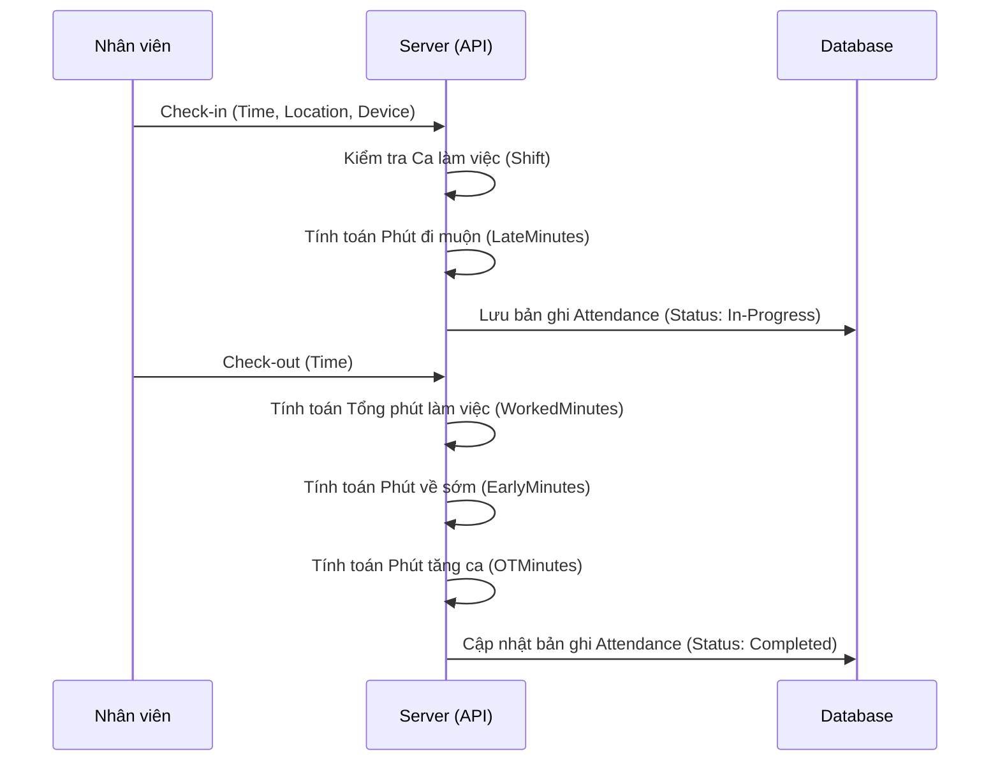
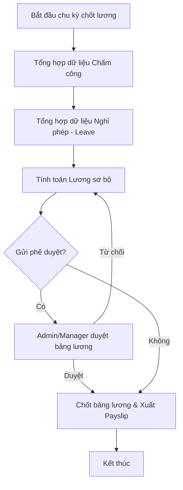

# 📊 Logic Nghiệp vụ Chấm công & Lương (Attendance & Payroll)

Tài liệu này mô tả chi tiết luồng xử lý và các công thức tính toán cho module Chấm công và Tính lương trong hệ thống HRM Pro.

## 1. Logic Chấm công (Attendance)

### 1.1 Luồng hoạt động
Hệ thống ghi nhận thời gian làm việc dựa trên cơ chế Check-in/Check-out.

### 1.2 Các chỉ số chính
| Chỉ số | Cách tính | Ghi chú |
| :--- | :--- | :--- |
| **LateMinutes** | `max(0, CheckInTime - Shift.StartTime)` | Tính nếu Check-in sau giờ bắt đầu ca. |
| **EarlyMinutes** | `max(0, Shift.EndTime - CheckOutTime)` | Tính nếu Check-out trước giờ kết thúc ca. |
| **WorkedMinutes** | `CheckOutTime - CheckInTime` | Tổng thời gian có mặt tại công ty. |
| **OTMinutes** | `max(0, WorkedMinutes - Shift.TotalStandardMinutes)` | Thời gian làm thêm ngoài giờ chuẩn. |

---

## 2. Logic Tính lương (Payroll)

Lương được tính toán định kỳ (thường là hàng tháng) dựa trên dữ liệu chấm công và cấu hình lương của nhân viên.

### 2.1 Công thức tính lương Gross
Hệ thống áp dụng công thức linh hoạt dựa trên giờ công thực tế:

$$Salary_{Gross} = (Hours_{Standard} \times Rate_{Hourly}) + (Hours_{OT} \times Rate_{OT}) + Allowance$$

Trong đó:
- **Hours_Standard**: Tổng số giờ làm việc chuẩn (không bao gồm OT).
- **Rate_Hourly**: Lương mỗi giờ. Nếu không cấu hình, tính bằng `BaseSalary / 176`.
- **Rate_OT**: Lương tăng ca. Mặc định bằng `Rate_Hourly * 1.5`.
- **Allowance**: Các khoản phụ cấp cố định.

### 2.2 Luồng xử lý bảng lương (Payroll Process)

---

## 3. Kế hoạch triển khai & Demo

### Bước 1: Hoàn thiện Backend (API)
- [ ] Bổ sung logic tính toán khấu trừ (Deductions) cho đi muộn/về sớm.
- [ ] Tích hợp dữ liệu Nghỉ phép (Leave) vào công thức tính lương (Nghỉ phép hưởng lương/không hưởng lương).
- [ ] Xây dựng API chốt bảng lương hàng tháng (Lock Payroll).

### Bước 2: Nâng cấp Frontend (UI/UX)
- [ ] Dashboard cá nhân: Hiển thị biểu đồ công xá và lương dự kiến thời gian thực.
- [ ] Module Quản lý bảng lương: Giao diện cho Admin kiểm tra và duyệt lương hàng loạt.
- [ ] Xuất file: Tối ưu hóa mẫu phiếu lương (PDF) chuyên nghiệp hơn.

### Bước 3: Demo (Simulation Case)

**Kịch bản mô phỏng: Nhân viên Nguyễn Văn A (Tháng 05/2026)**

*   **Thông tin cơ bản**:
    *   Lương cơ bản: 17,600,000 VNĐ (Tương đương 100,000 VNĐ/giờ).
    *   Phụ cấp: 1,000,000 VNĐ.
    *   Ca làm việc: 08:00 - 17:00 (Nghỉ trưa 1h).

*   **Dữ liệu Chấm công thực tế**:
    *   **Giờ công chuẩn**: Làm việc 20 ngày đầy đủ, 1 ngày nghỉ phép năm (có lương).
    *   **Đi muộn**: 4 lần, mỗi lần 15 phút (Tổng 60 phút).
    *   **Tăng ca (OT)**: 10 giờ (Ngày thường).

*   **Tính toán dự kiến**:
    1.  **Lương giờ công**: $(168 \text{ giờ thực làm} + 8 \text{ giờ nghỉ phép}) \times 100,000 = 17,600,000$ VNĐ.
    2.  **Lương OT**: $10 \text{ giờ} \times 150,000 = 1,500,000$ VNĐ.
    3.  **Khấu trừ đi muộn**: $60 \text{ phút} \times (100,000 / 60) = 100,000$ VNĐ.
    4.  **Tổng thực lĩnh**: $17,600,000 + 1,500,000 + 1,000,000 - 100,000 = 20,000,000$ VNĐ.

---
> [!IMPORTANT]
> Logic này cần được USER xác nhận trước khi tiến hành triển khai Backend & Frontend.
